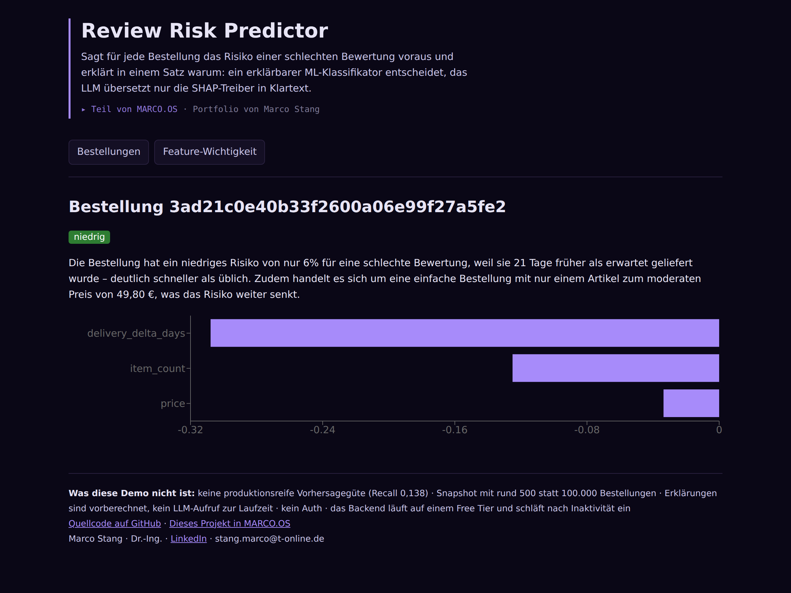
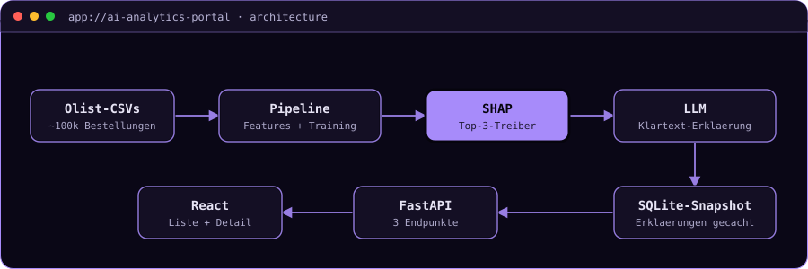

# Review Risk Predictor

**Sagt für jede Bestellung das Risiko einer schlechten Bewertung voraus und erklärt in
einem Satz warum: ein erklärbarer ML-Klassifikator trifft die Entscheidung, das LLM
übersetzt nur die SHAP-Treiber in Klartext.**


[](https://ai-analytics-portal-gray.vercel.app/)

> **▶ [Demo ausprobieren](https://ai-analytics-portal-gray.vercel.app/)**
> Öffne eine rot markierte Bestellung in der Liste: Die Detailansicht zeigt die drei
> stärksten Risikotreiber als Chart und darunter die Erklärung in einem Satz.
> *Das Backend läuft auf dem Render Free Tier und schläft nach 15 Minuten ein, der erste
> Aufruf danach kann rund 50 Sekunden dauern.*



<details>
<summary><b>🇬🇧 English summary</b></summary>

For every order in the Olist marketplace, a GradientBoostingClassifier estimates the risk
of a bad review. SHAP determines the top drivers per prediction, and an LLM turns them into
one plain-language sentence. Full-stack implementation with a React frontend and a FastAPI
backend. Metrics on a temporal test split: ROC-AUC 0.706, precision 0.632, recall 0.138,
which makes the model deliberately conservative rather than production-ready. Full
write-up in German below.
</details>

---

## In 30 Sekunden

Ein Risiko-Score allein hilft niemandem: Wer im Kundenservice sitzt, muss wissen, *warum*
eine Bestellung auffällig ist. Deshalb trifft hier ein klassischer, erklärbarer
ML-Klassifikator die Vorhersage anhand von Lieferzeit, Preis, Kategorie, Artikelanzahl und
Verkäufer-Historie. SHAP bestimmt die drei wichtigsten Treiber, und erst danach übersetzt
ein LLM diese Zahlen in ein bis zwei verständliche Sätze.

Das Projekt schließt bewusst die React/FastAPI-Full-Stack-Lücke neben den anderen
Portfolio-Projekten, die stärker auf Agenten und Cloud ausgerichtet sind.

## Die zentrale Entscheidung: kein Data Leakage bei der Verkäufer-Historie

Das stärkste Feature des Modells ist die bisherige Durchschnittsbewertung des Verkäufers.
Genau dieses Feature ist auch die gefährlichste Leakage-Falle: Berechnet man den
Durchschnitt naiv über alle Bestellungen, fließt die Bewertung der aktuellen Bestellung in
ihre eigene Vorhersage ein. Das Modell sähe im Training brillant aus und wäre in
Produktion wertlos.

Deshalb wird `seller_avg_review_prior` zeitlich sortiert und geshiftet: Nur Bestellungen
*vor* der aktuellen fließen ein, nie die eigene und nie spätere. Aus demselben Grund ist
auch der Train/Test-Split zeitlich und nicht zufällig, denn saisonale Effekte bei
Lieferzeiten würden bei einem Zufallssplit optimistisch verzerrte Metriken liefern. Die
Zahlen unten sind dadurch weniger beeindruckend, aber ehrlich.

<details>
<summary><b>▸ Deep Dive: warum keine Live-LLM-Calls und nur eine Stichprobe</b></summary>

Die Erklärungen werden einmalig beim Pipeline-Lauf erzeugt und im SQLite-Snapshot gecacht.
Die laufende Web-App braucht dadurch im Deployment keinen LLM-API-Key, was Kosten,
Latenz und eine Angriffsfläche spart.

Der Snapshot enthält rund 500 von etwa 100.000 Olist-Bestellungen, stratifiziert über
Risiko-Terzile. Ein LLM-Call pro Bestellung für den kompletten Datensatz wäre weder
zeitlich noch finanziell sinnvoll. Die aggregierte Feature-Wichtigkeits-Übersicht basiert
dagegen auf *allen* Bestellungen, denn die SHAP-Berechnung ist billig, nur die
LLM-Erklärung ist der teure Teil.

Ebenfalls bewusst: kein Live-Postgres. Die Olist-Daten werden offline zu einem
SQLite-Snapshot verarbeitet und mit ins Repo übernommen, statt einen zweiten dauerhaft
laufenden Datenbank-Service nur für dieses Projekt zu betreiben.
</details>

## Architektur



Alles links vom Snapshot läuft einmalig offline, alles rechts davon ist zur Laufzeit aktiv.
Das FastAPI-Backend hat drei Endpunkte und liest ausschließlich aus dem Snapshot.

## Was es kann, und was nicht

Modell-Metriken auf dem zeitlichen Testset (etwa 20 Prozent der Bestellungen):

| Metrik | Wert | Lesart |
|---|---|---|
| ROC-AUC | **0,706** | erkennt Risiko deutlich besser als Zufall |
| Precision | **0,632** | sagt das Modell „hoch", stimmt es meistens |
| Recall | **0,138** | es übersieht aber einen großen Teil der schlechten Reviews |

Das Modell ist damit ausgesprochen konservativ. Für eine Demo der
Explainability-Methodik reicht das, als Frühwarnsystem im Einsatz wäre der Recall zu
niedrig.

**24 Tests** (16 Backend mit pytest, 8 Frontend mit Vitest), beide Suiten ohne Netzwerk-
oder LLM-Zugriff.

**Was dieses Projekt nicht ist:** kein Anspruch auf produktionsreife Vorhersagegüte, kein
Auth, keine Multi-Tenancy, kein generisches BI-Tool. Der Snapshot zeigt eine Stichprobe von
rund 500 Bestellungen, nicht alle. Und das Backend auf dem Free Tier schläft ein, der
Cold-Start ist real.

## Selbst ausprobieren

Einmalig: `python -m venv .venv`, `.venv/Scripts/python.exe -m pip install -e ".[dev]"`,
`.env` aus [`.env.example`](.env.example) anlegen (nur für den Pipeline-Lauf nötig) und die
Olist-Rohdaten nach `data/raw/` kopieren.

```bash
.venv/Scripts/python.exe -m pipeline.run_pipeline                       # Snapshot erzeugen
.venv/Scripts/python.exe -m uvicorn src.api.main:app --reload --port 8000
cd frontend && npm install && npm run dev                               # Frontend
```

---

```console
marco@portfolio:~$ open marco-os --project ai-analytics-portal
```

**[▸ Dieses Projekt in MARCO.OS öffnen](https://maggostang-droid.github.io/marco-os/#ai-analytics-portal)**,
dem interaktiven Portfolio von Marco Stang.

**Schwesterprojekte:**
[SQL Copilot](https://github.com/maggostang-droid/sql-copilot) (LangGraph-Agent, gleicher Olist-Datensatz) ·
[Document Auto-Classifier](https://github.com/maggostang-droid/document-auto-classifier) (serverlos auf AWS) ·
[Medical Coding Extractor](https://github.com/maggostang-droid/medical-coding-extractor) (LoRA-Finetuning gegen RAG)

<sub>Marco Stang · Dr.-Ing. · [LinkedIn](https://www.linkedin.com/in/marco-stang) · stang.marco@t-online.de · MIT-Lizenz</sub>
