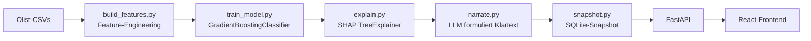

# ai-analytics-portal

Portfolio-Projekt von Marco Stang für Bewerbungen auf AI/KI-Rollen (ggf.
auch KI-Transformations-Rollen).

🔗 **[Projektseite](https://maggostang-droid.github.io/ai-analytics-portal/)**
— Überblick, Architektur, Motivation (kein Ersatz für die Live-Demo, siehe
unten).

## In 30 Sekunden

Für jede Bestellung im Olist-Marktplatz sagt dieses Portal voraus, wie
wahrscheinlich eine schlechte Kundenbewertung wird — und erklärt in einem
Satz, warum, statt nur eine Zahl auszuspucken. Ein klassischer,
erklärbarer ML-Klassifikator (nicht ein LLM) trifft die Vorhersage; ein
LLM übersetzt anschließend die SHAP-Treiber in verständlichen Klartext.

Full-Stack-Umsetzung mit React-Frontend + FastAPI-Backend, ergänzt
`sql-agent` (Agentic-AI/SQL) und `goz-finetune-vs-rag` (LLM-Finetuning)
um die React/FastAPI-Full-Stack-Lücke im Lebenslauf.

## Live-Demo

*(Folgt nach Deploy auf Vercel/Railway — siehe [`HANDOVER.md`](HANDOVER.md)
für den aktuellen Stand. Bis dahin: Quickstart unten für den lokalen Lauf.)*

## Was das Portal macht

1. **Vorhersagen.** Ein `GradientBoostingClassifier` (scikit-learn) schätzt
   pro Bestellung das Risiko einer schlechten Review (≤ 2 Sterne) anhand von
   Lieferzeit, Preis, Kategorie, Artikelanzahl und Verkäufer-Historie.
2. **Erklären.** SHAP (`TreeExplainer`) bestimmt die drei wichtigsten
   Einflussfaktoren pro Vorhersage — die Zahlen dahinter, nicht nur eine
   Ampel.
3. **Formulieren.** Ein LLM übersetzt die SHAP-Treiber in 1-2 verständliche
   Sätze auf Deutsch (Prompt + Beispiel siehe "Wie es funktioniert").
4. **Anzeigen.** Ein React-Frontend zeigt Bestell-Liste mit Risiko-Ampel,
   Detail-Ansicht mit Treiber-Chart + Erklärung, und eine aggregierte
   Feature-Wichtigkeits-Übersicht.

## Beispiel-Bestellungen

Drei echte Beispiele aus dem aktuellen Snapshot zeigen die Bandbreite:

| Risiko | Kategorie | Score | Erklärung |
|---|---|---|---|
| 🔴 Hoch | cool_stuff | 84 % | "Die Bestellung hat ein hohes Risiko für eine schlechte Bewertung (84%), weil die Lieferung 8 Tage zu spät kam und der Verkäufer bereits eine sehr schlechte durchschnittliche Bewertung von 2,0 Sternen hat. Die starke Verspätung ist dabei der wichtigste Faktor für das hohe Risiko." |
| 🟡 Mittel | garden_tools | 51 % | "Die Bestellung hat ein erhöhtes Risiko für eine schlechte Bewertung, weil die Lieferung 4 Tage später als geplant eintrifft – Lieferverzögerungen sind der mit Abstand stärkste Negativfaktor. Der ansonsten gute Verkäufer (durchschnittlich 4,4 Sterne) und die Produktkategorie Gartenwerkzeug können dies nur teilweise ausgleichen." |
| 🟢 Niedrig | other | 6 % | "Die Bestellung hat ein niedriges Risiko von nur 6% für eine schlechte Bewertung, weil sie 21 Tage früher als erwartet geliefert wurde – deutlich schneller als üblich. Zudem handelt es sich um eine einfache Bestellung mit nur einem Artikel zum moderaten Preis von 49,80 €, was das Risiko weiter senkt." |

**Modell-Metriken** (zeitlicher Testset-Split, ~20 % der Bestellungen):
ROC-AUC **0,706**, Precision **0,632**, Recall **0,138** — das Modell ist
konservativ: sagt es "hoch", stimmt es meistens (hohe Precision), aber es
übersieht auch einen Teil der schlechten Reviews (niedriger Recall). Für
eine Portfolio-Demo der Explainability-Methodik ausreichend, kein Anspruch
auf produktionsreife Vorhersagegüte.

## Wie es funktioniert



- **Kein Live-Postgres.** Die Olist-Daten werden einmalig offline zu einem
  SQLite-Snapshot (~500 Bestellungen) verarbeitet und mit ins Repo
  übernommen — vermeidet einen zweiten, dauerhaft laufenden DB-Service nur
  für dieses Projekt.
- **Stichprobe statt Vollständigkeit.** Der Snapshot enthält ~500 von
  ~100.000 Olist-Bestellungen (über Risiko-Terzile stratifiziert) — ein
  LLM-Call pro Bestellung für den kompletten Datensatz wäre weder
  zeitlich noch finanziell sinnvoll. Die aggregierte
  Feature-Wichtigkeits-Übersicht basiert dagegen auf **allen**
  Bestellungen (SHAP-Berechnung ist billig, nur die LLM-Erklärung ist
  der teure Teil).
- **Kein Live-LLM-Call zur Laufzeit der Web-App.** Erklärungen werden
  beim einmaligen Pipeline-Lauf generiert und im Snapshot gecacht — die
  laufende App braucht im Deployment keinen LLM-API-Key.
- **Zeitlicher, nicht zufälliger Train/Test-Split.** Ein zufälliger Split
  würde durch saisonale Trends (z.B. Lieferzeiten) optimistisch verzerrte
  Metriken liefern.
- **Kein Data Leakage bei `seller_avg_review_prior`.** Der
  Verkäufer-Durchschnitt fließt nur aus Bestellungen *vor* der aktuellen
  ein (zeitlich sortiert + geshiftet), nie aus der eigenen oder späteren
  Reviews desselben Sellers.

## Architektur

- `pipeline/build_features.py` — lädt Olist-CSVs, baut Feature-Tabelle
  (Lieferzeit-Delta, Preis, Kategorie, Artikelanzahl, Seller-Historie)
- `pipeline/train_model.py` — One-Hot-Encoding, zeitlicher Split,
  `GradientBoostingClassifier`-Training + Evaluation
- `pipeline/explain.py` — SHAP-Werte + Top-3-Treiber pro Vorhersage
- `pipeline/llm.py` / `narrate.py` — provider-agnostische LLM-Anbindung
  (LangChain `init_chat_model`, wie `sql-agent`) + Klartext-Erklärung
- `pipeline/snapshot.py` / `run_pipeline.py` — SQLite-Snapshot-Schreiben +
  End-to-End-Orchestrierung
- `src/api/main.py`, `db.py`, `schemas.py`, `routes/orders.py`,
  `routes/insights.py` — FastAPI-Backend (3 Endpunkte, liest nur aus dem
  Snapshot)
- `frontend/src/pages/` — `OrderList`, `OrderDetail`, `FeatureImportance`
- `frontend/src/components/` — `RiskBadge`, `DriverChart`,
  `ImportanceChart`
- `frontend/src/api/client.ts` — typisierter Fetch-Client

## Tech-Stack

| Bereich | Technologie | Zweck |
|---|---|---|
| ML | scikit-learn (`GradientBoostingClassifier`), SHAP | erklärbare Risiko-Vorhersage |
| LLM-Anbindung | LangChain (`init_chat_model`) + langchain-anthropic / langchain-openai | provider-agnostisch über `.env`, wie `sql-agent` |
| Backend | FastAPI, Pydantic, SQLite | 3 REST-Endpunkte, kein Live-Postgres nötig |
| Frontend | React 18, Vite, TypeScript, react-router-dom | Bestell-Liste, Detail-Ansicht, Insights-Seite |
| Charts | Recharts | Treiber-Chart, Feature-Wichtigkeits-Chart |
| Tests | pytest (Backend, 16 Tests), Vitest + React Testing Library (Frontend, 8 Tests) | beide Suiten ohne Netzwerk/LLM-Zugriff |
| Packaging | setuptools (Python), npm (Frontend) | `pip install -e ".[dev]"` / `npm install` |
| Projektseiten-Hosting | GitHub Pages | `docs/index.html`, self-contained, kein CDN |

## Quickstart

**Backend:**

```bash
python -m venv .venv
.venv/Scripts/python.exe -m pip install -e ".[dev]"
cp .env.example .env  # nur für Pipeline-Lauf: LLM_PROVIDER/LLM_MODEL/API-Key

.venv/Scripts/python.exe -m pytest tests/ -v

# Olist-Rohdaten (aus sql-agent/data/raw/) nach data/raw/ kopieren, dann:
.venv/Scripts/python.exe -m pipeline.run_pipeline   # erzeugt data/olist_snapshot.sqlite

.venv/Scripts/python.exe -m uvicorn src.api.main:app --reload --port 8000
```

**Frontend** (neues Terminal):

```bash
cd frontend
npm install
echo "VITE_API_BASE_URL=http://localhost:8000" > .env
npm run dev
```

## Tests

- **Backend:** `pytest tests/ -v` — 16 Tests, kein Netzwerk-/LLM-Zugriff
  nötig (LLM-Aufrufe werden mit einer Fake-LLM-Klasse getestet, die API
  liest aus einer In-Memory-SQLite-Fixture).
- **Frontend:** `npm run test` (Vitest) — 8 Tests, API-Calls per
  `vi.spyOn`/`vi.fn` gemockt, kein echtes Backend nötig.

## Weiterführende Dokumentation

- [`docs/superpowers/specs/`](docs/superpowers/specs/) — Design-Spec mit
  allen Architekturentscheidungen
- [`docs/superpowers/plans/`](docs/superpowers/plans/) — Implementierungsplan
  (15 Tasks, inkl. vollständigem Code pro Task)
- [`HANDOVER.md`](HANDOVER.md) — Projektstatus + bekannte offene Punkte,
  gedacht für den Wiedereinstieg ohne vorherigen Kontext

## Limitierungen

- Kein Anspruch auf produktionsreife Vorhersagegüte (Recall 0,14 — ein
  relevanter Teil schlechter Reviews wird nicht erkannt).
- Kein Auth, keine Multi-Tenancy, kein generisches BI-Tool.
- Kein Live-Postgres, keine Live-Verbindung zu `sql-agent`s Datenbank.
- Snapshot zeigt eine ~500er-Stichprobe der Bestellungen, nicht alle
  ~100.000 (Kosten-/Zeitgründe für die LLM-Erklärungen, siehe oben).
- Live-Deploy (Vercel/Railway) steht noch aus, siehe `HANDOVER.md`.
